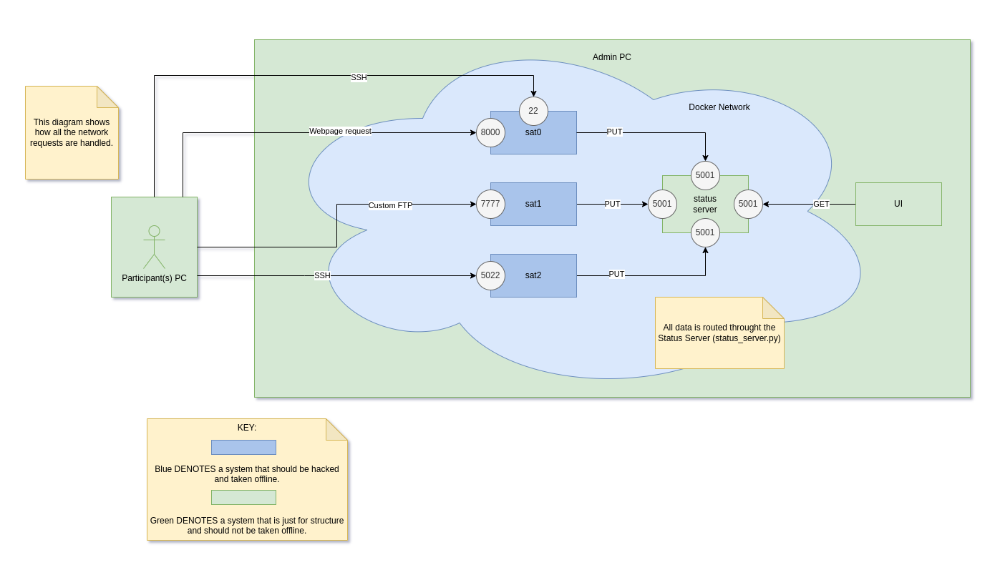

## Operation Starcom

3 satellites will be running as a set of docker containers, each of them will have a set of vulnerabilities that will allow remote access from the cadets. A UI display will show the status of all the satellites and their connection with the Starcom Command Center (where the cadets are hacking from).

1. One of the satellites (starcom0) will be running a vulnerable web application that contains logs of passwords. Directory brute forcing and log examining will lead to an SSH login being obtained.

2. Another satellite (starcom1) will be taken offline as it is running a vulnerable FTP server. This server is very simple and written in python. The cadets will reverse engineer the code and write a few lines into their client to exploit the vulnerability.

3. Lastly, the final satellite (starcom2) will only be vulnerable when access to a physical USB is obtained. This will be done by a mission scenario with a high value target who is carrying it. After this, the satellite will be taken offline via John the Ripper and SSH.

## Authors Note

I wanted to make a special note on this CTX about realism. The technology of this CTX is real in that these technologies are used to professionally hack things, but it is not real in that satellites are not accessible via SSH/Dirb/FTP over the open internet. In addition, most satellites aren't running a webserver, an FTP server, or a linux operating system.

With all that in mind, this CTX aims to provide value by giving cadets a look into what pentesting common systems looks like. It also aims to provide value by providing them with an engaging look into a space themed CTX.

### Objectives

Estimated Time: 1.5 hours


Estimated skills (see [skill levels](https://github.com/CyberTrainingExercise/Docs/blob/master/ctx_requirements.md) for meaning)
- Programming skills required (0-3)
    - 2
- System adminitration skills required (0-3)
    - 2
- Pentesting skills required (0-3)
    - 2

Skills required for Admin:
- Python
- Linux
- Docker
- Kali (John the Ripper, dirb, and nmap)
- Webservers
- Representational state transfer (REST)


Time requirements (Recommended):
- 1.5 hrs total
    - 15 for briefing / planning
    - 75 for execution

Technical Objectives:
1. Port scanning
1. Reverse engineering
1. FTP servers
1. Attacking web services
1. SSH

## Requirements

1. Machine capable of running Docker and a Unity Executable
1. At least 1 machine capable of running Kali, Python3, and a code editor
    - A minimum of 2 is recommended as these tools will be needed to take down sat0 and sat1, but 3-4 might be helpful for larger groups.
1. USB Stick
1. Duckies for FTX small unit tactics

## Expected Design

This CTX is designed as part of a larger scale FTX. It was initially designed as a subsection of a 4hr FTX for RIT's Spring 2022 FTX. The goal was to introduce basic hacking skills in a Space Force themed enviroment.

The recommended team size is 5-10, with at least several members being skilled technically. The Leader is expected to juggle these technical tasks with the real world FTX tasks.


### Scenario

Team is briefed with the following.

```
Welcome to the Starcom Satellite Command Center.

While you were taking control of the DLAB the Yuktobanian soldiers activated their satellite based missile system. From now on, if you or any of your team step outside of the DLAB and nearby buildings, you will be shot by enemy missiles.

However, allied forces have been gathering intel on this satellite system and believe that it contains a set of vulnerabilities and can be taken offline by a skilled team of hackers. When each satellite is taken offline, there will be a 10 minute window displayed on the screen where you can go outside. The entire satellite system takes 30 minutes to orbit with each satellite providing 10 minutes of coverage.

1. One of the satellites (starcom0) is reported to be running a vulnerable web application that details the status of the missile system. You are tasked with taking this satellite offline. Intel believes the following tools will be all you need to complete the job.
- IP address of starcom0: [insert IP here]
- nmap
- dirb
- ssh
- Machine with Kali

2. Another satellite (starcom1) will be taken offline as it is running a vulnerable FTP server. The exact vulnerability in unknown, but we have managed to gain access to the source code. You will need to reverse engineer the server, add code to the client, and exploit the vulnerability.
- IP address of starcom1: [insert IP here]
- Machine with VSCode, Python, and the FTP server and client code

3. Lastly, the final satellite (starcom2) will only be vulnerable when access to a physical USB is obtained. This will be done by a mission scenario with a high value target who is carrying it. You will need the following tools.
- IP address of starcom2: [insert IP here]
- John the Ripper
- ssh
- Machine with Kali

Do you have any questions?

```

## Difficulty Dials

To add difficulty, simple add or remove the amount of technical help they can have.

## Docs

WORK IN PROGRESS

## Setup

Please use the following system diagram to help inform your setup.



1. Install Docker, Docker-Compose, and Python3 on the Admin PC.
1. Run `docker-compose up -d --build`
    - You should get all 4 containers with a green `done`
1. Run the Starcom UI
    - Verify that all the status's are `ok`
1. Gather IP addresses
1. Load them onto the encrypted zip file `zip -e secret_files.zip file1.txt`

### Onsite Setup

1. Turn on the Admin PC
1. Run `docker-compose up -d`
1. Gather IP addresses
1. Load them onto the encrypted zip file `zip -e secret_files.zip file1.txt`
1. Verify code is on Python machine with Python/VSCode
1. Verify FTP client can connect to sat1
    - Run the code and try to send a file
1. Verify SSH works for both sat0 and sat2
1. Verify the Webserver is running on port 8000 for sat0
    - Visit `ip:8000` in the browser
1. Give briefing
